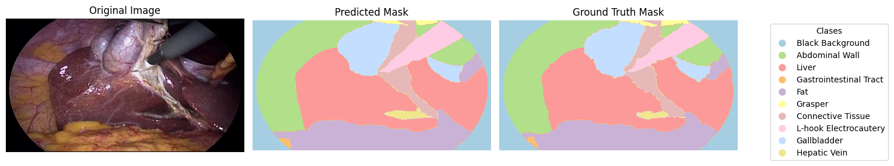

# TFG: Segmentación Semántica en Cirugía Laparoscópica con Optimización para Clases Minoritarias

Este repositorio contiene el código desarrollado en el Trabajo de Fin de Grado *“Segmentación Semántica en Cirugía Laparoscópica con Optimización para Clases Minoritarias”*.  

El trabajo implementa una **Attention U-Net**, una extensión de la U-Net original que incorpora mecanismos de atención, para segmentar imágenes laparoscópicas del dataset [CholecSeg8k](https://www.kaggle.com/datasets/newslab/cholecseg8k).  
Se han aplicado técnicas de *data augmentation* y estrategias específicas de optimización para mejorar la segmentación de **clases poco representadas**, con el objetivo de aumentar la capacidad de generalización frente a distintos contextos quirúrgicos y condiciones visuales.  

El propósito principal del modelo es identificar y delimitar tanto los distintos elementos anatómicos como las herramientas quirúrgicas más comunes presentes en el **campo quirúrgico**.

---

## Índice
- [Requisitos](#requisitos)
- [Cómo ejecutar un entrenamiento del modelo](#cómo-ejecutar-un-entrenamiento-del-modelo)
  - [1. Descargar el dataset desde Kaggle](#1-descargar-el-dataset-desde-kaggle)
  - [2. Ejecutar el entrenamiento](#2-ejecutar-el-entrenamiento)
- [Ejemplo de resultados](#ejemplo-de-resultados)
- [Licencia](#licencia)

---

## Requisitos

Instala todas las dependencias directamente con:

```bash
pip install -r requirements.txt
```

## Cómo ejecutar un entrenamiento del modelo

### 1. Descargar el dataset desde Kaggle

Para descargar el dataset `CholecSeg8k` usando el script `download_dataset.py`, sigue estos pasos:

#### 1.1 Obtener tus credenciales Kaggle

- Accede a [Kaggle](https://www.kaggle.com/) y entra en tu cuenta.
- Ve a **My Account** > **API** > **Create New API Token**.
- Se descargará un archivo llamado `kaggle.json` que contiene tu `username` y `key`.

#### 1.2 Crear un archivo `.env`

En la raíz del proyecto, crea un archivo llamado .env con este contenido:

KAGGLE_USERNAME=tu_usuario_kaggle
KAGGLE_KEY=tu_key_kaggle
DATASET_PATH=./data/cholecseg8k
OUTPUT_DIR=directorio_salida_de_archivos


DATASET_PATH: ruta donde se descargará el dataset.
Por defecto, el script lo descarga en ./data/cholecseg8k.

OUTPUT_DIR: carpeta donde se guardarán resultados del modelo: métricas, predicciones, imágenes generadas, etc.

Reemplaza tu_usuario_kaggle y tu_key_kaggle por los valores que aparecen en el archivo kaggle.json.

#### 1.3 Descargar el dataset

Ejecuta el siguiente comando para descargar y extraer el dataset:

```bash
python src/download_dataset.py
```

### 2. Ejecutar el entrenamiento

Tras haber descargado el dataset, ejecuta el siguiente comando y se iniciará un entrenamiento durante 50 épocas o, durante 11 horas seguidas:

```bash
python src/main.py
```

## Ejemplo de resultados

Comparación entre predicciones del modelo tras entrenarlo durante 1 época y tras 54 épocas:




## Licencia

El código fuente se distribuye bajo licencia MIT.

La memoria escrita y documentación se publican bajo licencia Creative Commons CC BY-NC-SA 4.0.

Esto significa que cualquiera puede usar, compartir y adaptar el contenido con atribución, siempre que no se use con fines comerciales y las obras derivadas se compartan bajo la misma licencia.
